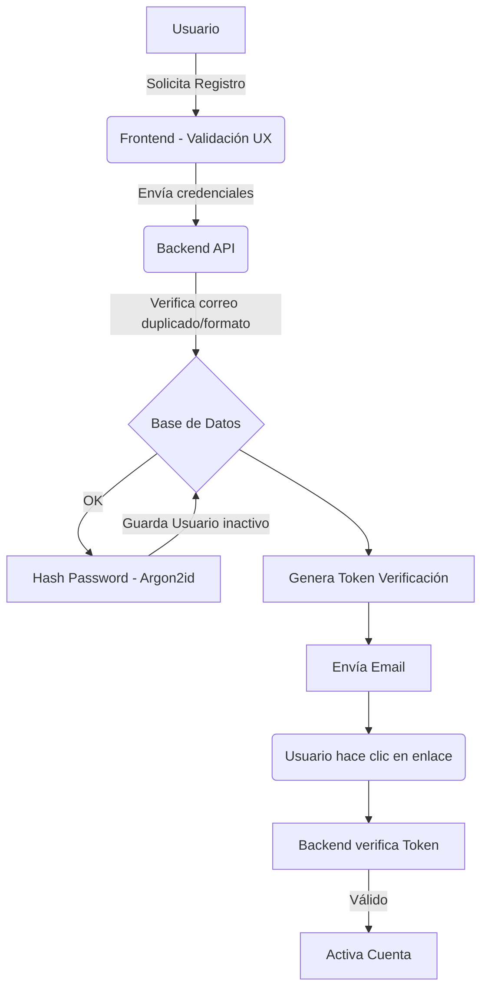

# Sistema de Autenticación y Seguridad - Diseño Arquitectónico

Este documento representa el diseño integral del sistema de autenticación y seguridad para **Jewelry Prime**, elaborado por el equipo conjunto de Arquitectura de Seguridad, Backend, Full Stack, UX, DevOps, Base de Datos y QA Security. 

El diseño se basa estrictamente en el **OWASP Top 10**, **OWASP ASVS** y las directrices de identidad digital del **NIST (NIST SP 800-63B)**.

---

## 1. Arquitectura General

El sistema utilizará una arquitectura basada en **Tokens JWT (JSON Web Tokens)** transmitidos de forma segura mediante **Cookies HTTPOnly, Secure y SameSite=Strict**, respaldados por sesiones en base de datos para permitir la revocación inmediata.

### Diagrama de Flujos Principales

* **Flujo de Inicio de Sesión:** El usuario envía credenciales. El backend compara el hash de la contraseña usando un algoritmo seguro (Argon2id). Si es exitoso, crea un registro de sesión en la BD, genera un JWT (con vida corta) y un Refresh Token (guardado en DB) que se envían al cliente vía HTTPOnly cookies.
* **Manejo de Sesiones:** Se emplea un enfoque híbrido. El JWT corto evita accesos a DB en cada petición, pero se requiere el Refresh Token almacenado en cookie para renovarlo.
* **Expiración y Revocación:** JWT expira en 15 minutos. El Refresh Token expira en 7 días de inactividad o 30 días de vida máxima absoluta. Si un usuario cambia la contraseña, o el admin lo expulsa, el campo `tokenVersion` en la base de datos se incrementa o la sesión en DB se elimina, invalidando instantáneamente los tokens emitidos.

---

## 2. Roles del Sistema

El sistema implementará Control de Acceso Basado en Roles (RBAC).

| Rol | Permisos | Acceso a Páginas | Consumo de APIs |
|---|---|---|---|
| **Cliente** | Leer catálogo, gestionar perfil, crear pedidos, consultar historial. | Home, Catálogo, Carrito, Checkout, Perfil. | `GET /api/products`, `POST /api/orders`, `GET/PUT /api/users/me` |
| **Administrador** | Todos los permisos de cliente + Gestión de inventario, usuarios y configuración global. | Todo + `/admin/*` (Dashboard, Inventario, Editor). | Todo + `POST/PUT/DELETE /api/products`, `GET /api/users` |

---

## 3. Panel Administrativo

La protección del panel administrativo requiere defensa en profundidad (Defense in Depth).

1. **Frontend (Capa UX):** Si el estado local no detecta el rol `admin`, las rutas bajo `/admin` redirigen al `/login` inmediatamente.
2. **Backend (La Verdad Absoluta):** **Nunca se confía en el frontend**. Todas las peticiones a rutas `/api/admin/*` pasan por dos middlewares:
   * `requireAuth`: Valida el JWT y la sesión activa en BD.
   * `requireRole('admin')`: Extrae el ID del usuario del JWT validado, consulta el rol real en la base de datos (no en el token, para evitar escalamiento de privilegios por tokens desactualizados) y bloquea con un `403 Forbidden` si no coincide.
3. Si alguien escribe la URL del panel manualmente, el frontend intenta cargar la página, hace una petición inicial `/api/auth/me` para verificar el estado. Al devolver 403, el frontend expulsa al usuario a la página de inicio.

---

## 4. Inicio de Sesión

* **Validaciones:** Se sanitizan los inputs para evitar inyección. Se valida el formato de correo.
* **Fuerza Bruta y Credential Stuffing:** Implementación de *Rate Limiting* (límite de tasa) específico para el endpoint `/api/auth/login`. Máximo 5 intentos fallidos por IP/Usuario en 15 minutos. Al superar el límite, la cuenta (o la IP) entra en enfriamiento (Lockout) por 30 minutos.
* **Enumeración de usuarios:** Los mensajes de error serán genéricos. Independientemente de si el correo existe o la contraseña es incorrecta, el mensaje será: *"Credenciales inválidas"*. El tiempo de respuesta de la API será normalizado para evitar *Time-based enumeration*.
* **Cerrar sesión global:** Existirá un endpoint `/api/auth/logout-all` que eliminará todas las sesiones activas en la tabla de sesiones de la BD para ese usuario.

---

## 5. Registro de Usuario

* **Formulario:** Nombre, Email, Password, Confirmación, Checkboxes obligatorios de Términos y Privacidad.
* **Validación Backend:** Verifica existencia de email sin informar al cliente si ya existe (para evitar enumeración, si el correo existe, el API devuelve 200 OK pero envía silenciosamente un correo avisando al dueño original que alguien intentó registrarse con su cuenta).
* **Flujo Seguro:**
  1. Se genera un hash de la contraseña usando `Argon2id`.
  2. Se guarda en BD con `isVerified: false`.
  3. Se genera un `verificationToken` de 64 bytes criptográficamente seguro (usando `crypto.randomBytes`). Se hashea con SHA-256 antes de guardarlo en BD (para que si la BD es comprometida, el atacante no tenga el token crudo).
  4. Se envía el token crudo por email.
  5. La cuenta no puede hacer login hasta su verificación.

---

## 6. Confirmación por Correo

* **Enlace:** `https://midominio.com/verify?token=abc123XYZ`
* **Expiración:** 24 horas.
* **Un solo uso:** Al validarse, el campo `verificationToken` en BD se establece a `null` y `isVerified` a `true`.
* **Abuso:** Si el usuario solicita reenvío, el token anterior se invalida. Límite de 3 reenvíos por hora.
* Si expira, el usuario puede pedir uno nuevo en la pantalla de login. Reutilizar un enlace muestra "Enlace inválido o expirado".

---

## 7. Recuperación de Contraseña

* Al solicitar recuperación, el backend no indica si el correo existe. Muestra: *"Si el correo está registrado, recibirás un enlace"*.
* Se genera un `resetPasswordToken`, se hashea con SHA-256 en BD con expiración de 15 minutos.
* Al usar el enlace, se pide la nueva contraseña (verificando la misma política de seguridad).
* Al cambiar la contraseña:
  1. Se actualiza el hash en BD.
  2. Se establece `tokenVersion++` o se eliminan todas las sesiones activas del usuario, forzando un cierre de sesión en todos sus dispositivos de forma inmediata.

---

## 8. Política de Contraseñas (NIST Guidelines)

* **Longitud mínima:** 12 caracteres.
* **Longitud máxima recomendada:** 128 caracteres.
* **Composición:** No se obliga al usuario a memorizar reglas absurdas (mayúsculas, caracteres especiales), sino que se prioriza la **longitud** (passphrases). Sin embargo, se medirá la entropía en el frontend (usando bibliotecas como zxcvbn).
* **Contraseñas comprometidas:** El backend verificará la contraseña contra bases de datos de brechas (ej. la API K-Anonymity de *Have I Been Pwned*).
* **Almacenamiento:** Uso exclusivo de **Argon2id** (resistente a ataques GPU y side-channel).

---

## 9. Protección de Datos en Reposo y Tránsito

* **Tránsito:** Uso estricto de HTTPS (TLS 1.3). HSTS (HTTP Strict Transport Security) habilitado.
* **Sesiones/Tokens:** Usar `HttpOnly`, `Secure` y `SameSite=Strict` para prevenir robo vía XSS y ataques CSRF.
* **Variables de entorno y llaves:** Uso de un gestor de secretos (ej. AWS Secrets Manager o Doppler). Las claves privadas no deben existir en el repositorio (usar `.env` no versionado).
* **Datos personales:** Nombres y direcciones no necesitan cifrado simétrico en BD, pero la base de datos entera (Data at Rest) debe estar cifrada por el proveedor de nube (KMS, AES-256).

---

## 10. Defensa contra Ataques (OWASP Top 10)

* **SQL/NoSQL Injection:** Uso estricto de ORMs/ODMs (Prisma o Mongoose) que escapan los datos mediante consultas parametrizadas. Ningún dato del usuario se concatena directamente.
* **XSS:** React.js ya escapa el contenido renderizado (evitando XSS reflejado/persistido). Se configurarán encabezados **CSP (Content Security Policy)** estrictos en el servidor.
* **CSRF:** Al usar cookies con `SameSite=Strict` y peticiones CORS configuradas estrictamente a los orígenes permitidos, el riesgo de CSRF se mitiga drásticamente.
* **Session Hijacking / Fixation:** Los IDs de sesión se rotan después de cada autenticación (login). Las cookies `Secure` previenen secuestro en redes sin cifrar.
* **IDOR (Insecure Direct Object Reference):** Cada endpoint que acceda a recursos (`/api/orders/:id`) validará primero que el `:id` pertenezca al `userId` del JWT actual (salvo que sea rol Admin).

---

## 11. Esquema de Base de Datos (Relacional o Documental)

**Colección/Tabla: `User`**
* `id` (UUID o ObjectId)
* `name` (String)
* `email` (String, Indexed, Unique)
* `passwordHash` (String)
* `role` (Enum: 'client', 'admin')
* `isVerified` (Boolean, default: false)
* `verificationTokenHash` (String, nulo al verificar)
* `verificationTokenExpires` (Date)
* `resetPasswordTokenHash` (String)
* `resetPasswordTokenExpires` (Date)
* `tokenVersion` (Int, para revocar JWTs)
* `failedLoginAttempts` (Int, default: 0)
* `lockedUntil` (Date)

**Colección/Tabla: `Session`** (Opcional, si el refresh se hace por estado)
* `id` (UUID)
* `userId` (FK User)
* `refreshTokenHash` (String)
* `userAgent` (String)
* `ipAddress` (String)
* `expiresAt` (Date)

---

## 12. Experiencia del Usuario (UX Security)

* **Mensajes neutrales:** "Ocurrió un error al procesar tu solicitud" en lugar de "Fallo en la consulta de BD en la línea 45".
* **Medidor visual:** Barra de fortaleza de la contraseña en tiempo real durante el registro.
* **Transparencia:** Si la cuenta está bloqueada por demasiados intentos, indicar amablemente: "Por tu seguridad, hemos pausado los accesos. Intenta en 30 minutos".
* Feedback visual inmediato cuando un email de confirmación es despachado.

---

## 13. Privacidad y Confianza (Legal y Percepción)

* En el Footer y durante el registro, enlaces claros a **Aviso de Privacidad** y **Términos de Servicio**.
* Cajas de verificación separadas y obligatorias (no pre-marcadas) en el registro para el tratamiento de datos.
* Uso de banners descriptivos pero no intrusivos de políticas de cookies.
* Candado de seguridad HTTPS (forzado mediante redirección 301 de HTTP a HTTPS a nivel de balanceador o servidor web).

---

## 14. Plan de Implementación por Fases

> [!IMPORTANT]
> Este plan debe aprobarse antes de modificar cualquier código en el repositorio.

* **Fase 1 (Arquitectura Base):** Configuración de Node.js/Express, CORS estricto, variables de entorno, y conexión segura a la base de datos.
* **Fase 2 (Modelado BD):** Creación de esquemas (Prisma/Mongoose) para usuarios y sesiones.
* **Fase 3 (Registro y Hashing):** Creación del endpoint `/register`, integración de Argon2id y validaciones de esquema (Zod/Joi).
* **Fase 4 (Mailing y Verificación):** Integración de un proveedor de correos (Resend/SendGrid) y lógica del endpoint `/verify`.
* **Fase 5 (Login y Sesiones):** Implementación de emisión de JWT, validación de credenciales, rate limiting y cookies HTTPOnly.
* **Fase 6 (Panel Administrativo):** Creación de middlewares de Autorización (`requireAdmin`), y protección del router de React en el Frontend.
* **Fase 7 (Recuperación):** Flujos de olvido y reseteo de contraseña.
* **Fase 8, 9 y 10 (Auditoría, QA y PenTest):** Batería de pruebas automatizadas, inyección de variables sucias y revisión de cabeceras de seguridad (Helmet).

---

## Preguntas Abiertas para Aprobación
1. ¿La base de datos será de tipo SQL (PostgreSQL/MySQL vía Prisma) o NoSQL (MongoDB vía Mongoose) para el backend definitivo?
2. ¿Qué servicio de envío de correos electrónicos prefieres utilizar para los flujos de confirmación (Resend, SendGrid, Amazon SES)?

Por favor, revisa esta arquitectura. Si estás de acuerdo, haz clic en **Proceed** para que comencemos con la Fase 1.
